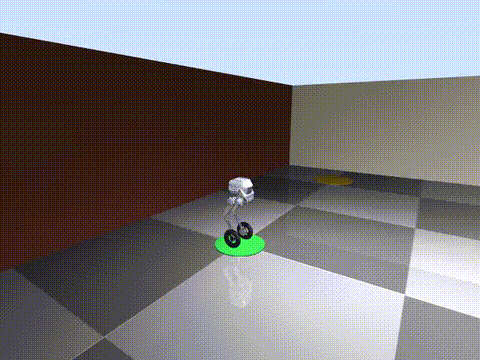
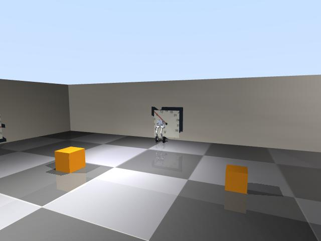
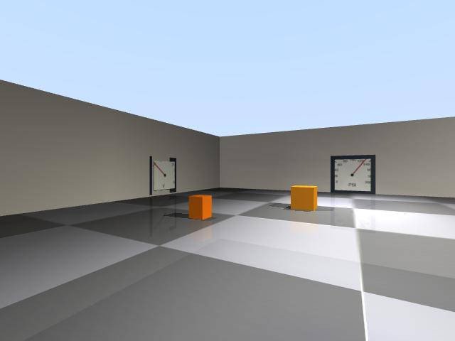

# Tron 1 · Hermes Agent

**A self-improving robotics AI agent running live on Mac.** The Hermes agent drives the LimX Tron 1 through a MuJoCo simulation, reads analog gauges with a local vision model (Qwen 2.5 VL on MLX), and teaches itself between runs by editing its own skill files. No cloud APIs for vision, no Unity/Unreal, no ROS 2 on the Mac — everything runs natively.

[](sim/demo_drive.mp4)

> *6-second clip: Tron 1 driving in the simulation. Bent-knee standing pose matches the real WF_TRON1A; wheels rotate visually at ω=v/r as the base moves. Full MP4: [`sim/demo_drive.mp4`](sim/demo_drive.mp4).*

---

## Live progress

*Auto-updated every ~10 minutes. Last sync: **2026-04-22 01:42:51**.*

**371 total episodes · 50% success on the last 30**

**pose** `(+0.00, -4.00, yaw=+1.29)`  
**gauges** N=159.83 PSI · E=2.40 °C · W=9.87 BAR

### Per-task breakdown

| task | ✓ / total | success % | avg reward |
|---|---|---|---|
| `describe-scene` | 22/22 | **100%** | +0.80 |
| `navigate-forward-2m` | 1/1 | **100%** | +1.00 |
| `count-obstacles` | 25/29 | **86%** | +0.59 |
| `find-door` | 15/20 | **75%** | +0.15 |
| `read-gauge-N` | 66/138 | **48%** | +0.18 |
| `navigate-to-charge` | 10/36 | **28%** | +0.08 |
| `read-any-gauge` | 23/85 | **27%** | +0.09 |
| `navigate-home` | 9/39 | **23%** | -0.26 |
| `read-visible-gauge` | 0/1 | **0%** | -0.20 |

See [`status/stats.md`](status/stats.md) for the full episode log and
[`status/transcripts/`](status/transcripts/) for what the agent actually said in each run.

### Live camera snapshots

| top-down | ego | chase |
|---|---|---|
|  |  |  |

---

## What is this?

A complete, working Mac-native robotics agent stack:

- **Simulation** ([`sim/`](sim/)) — MuJoCo with the actual WF_TRON1A meshes, 3 procedurally-rendered analog gauges on different walls, obstacles, and a door. Kinematic base control (no walking policy needed) with visually spinning wheels.
- **Hermes tools** ([`hermes_tools/`](hermes_tools/)) — `tron1_*` tools that drive the robot (`tron1_velocity`, `tron1_goto`, `tron1_get_image`, …) plus `qwen_vl_local` for on-device vision with MLX.
- **Self-play harness** ([`selfplay/`](selfplay/)) — 7-task bank with per-task graders that query the sim for ground truth. Failed episodes trigger a 60-second reflection pass where Hermes patches the relevant SKILL.md with one actionable lesson.
- **Live dashboard** ([`dashboard/`](dashboard/)) — browser-viewable at http://127.0.0.1:5557/ when running locally. Shows live camera feeds, episode history, skill files with edit timestamps, and a pass/fail sparkline.
- **Skills** ([`skills/`](skills/)) — the agent's procedural memory. These files grow as the agent self-reflects on failures.
- **ROS 2 sidecar** ([`ros2_sidecar/`](ros2_sidecar/)) — the matching VM-side / real-Tron 1 bridge so the same Hermes tools work on the physical robot.
- **Training** ([`training/`](training/)) — MLX LoRA fine-tune pipeline for Qwen 2.5 VL on synthetic gauge images.

---

## Run it yourself

The easiest way: **build the clickable Mac app** (one-time), then double-click it forever after.

```bash
bash scripts/build_app.sh
```

That drops `Tron 1.app` in `~/Applications/` (with a custom icon generated from a sim render), plus a Desktop alias. Double-click Tron 1 on your Desktop — it silently brings up sim + dashboard + GitHub auto-push, then opens the browser dashboard at **http://127.0.0.1:5557/** with a Control Panel (start/stop/restart every component).

Command-line alternatives if you prefer:

```bash
./scripts/start_all.sh                    # sim + dashboard
./scripts/start_all.sh viewer             # + the MuJoCo native 3D window
./scripts/start_all.sh selfplay 20        # + 20 self-play episodes
```

Full setup notes in [`DELIVERY.md`](DELIVERY.md).

---

## The self-learning proof

Every time an episode fails, Hermes gets one cheap turn with just the `skills` toolset and a prompt like:

> *"A previous run of task X just FAILED (reason Y). Append ONE concise actionable bullet to `~/.hermes/skills/robotics/Z/SKILL.md` under a `Lessons` or `Failure notes` section..."*

The agent calls `skill_manage(action="patch")` and writes back a lesson it
extracted from the transcript. Next session reads the updated SKILL.md and
behavior changes — no retraining, no gradient step, just markdown getting
smarter over time.

**Concrete example** (from the current `read-wall-gauge.md`):

> *"Suspiciously round values (exact multiples of 10/100) often indicate the VLM snapped to a major tick instead of interpolating; on round outputs, always re-capture from a 15° offset or 20 cm closer and average."*

The current [`skills/read-wall-gauge.md`](skills/read-wall-gauge.md) contains **16 agent-authored lessons** like this, covering specific VLM failure modes on different gauge types. That file was ~3 KB when seeded; it's now 10+ KB.

---

## Repo layout

```
.
├── DELIVERY.md            # Full deliverable doc
├── README.md              # Auto-regenerated with latest stats (this file)
├── sim/                   # MuJoCo sim + scene + demo video
├── dashboard/             # HTTP progress dashboard
├── selfplay/              # Task bank, graders, self-play loop
├── hermes_tools/          # Hermes-callable tron1_* + qwen_vl_local
├── skills/                # Robotics SKILL.md files (the agent's procedural memory)
├── training/              # MLX LoRA pipeline
├── ros2_sidecar/          # VM / real-robot ROS 2 bridge
├── scripts/               # start_all.sh, sync/auto-push
└── status/                # Auto-updated every 10 min:
    ├── stats.md           #   human-readable scoreboard
    ├── stats.json         #   machine-readable
    ├── episodes_recent.jsonl  # last 500 episode records
    ├── cam_top.jpg        #   live top-down view
    ├── cam_ego.jpg        #   live robot POV
    ├── cam_tp.jpg         #   live chase view
    ├── skills/            #   snapshot of SKILL.md files
    └── transcripts/       #   last 10 Hermes episode transcripts
```

---

## License

MIT — see [LICENSE](LICENSE). Built on top of:

- [LimX WF_TRON1A MJCF + meshes](https://github.com/limxdynamics/tron1-mujoco-sim) (BSD-3)
- [Nous Research · Hermes Agent](https://github.com/NousResearch/hermes-agent) (MIT)
- [MLX-VLM](https://github.com/Blaizzy/mlx-vlm) (MIT)
