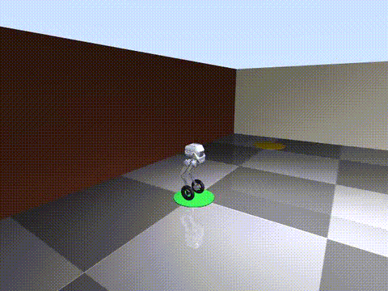
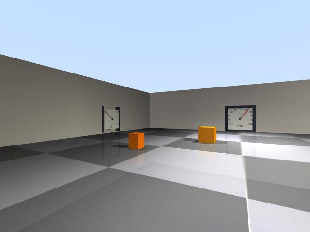
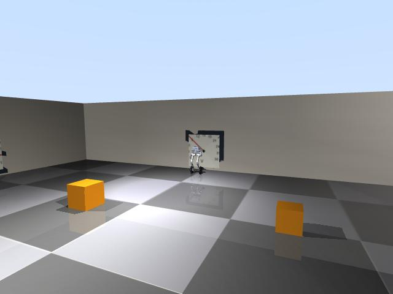

# Tron 1 · Hermes Agent

> **A self-improving robotics AI agent that drives a LimX Tron 1 robot through a MuJoCo simulation on a Mac — zero cloud APIs, zero ROS 2, zero gradient steps.**
> The agent reads gauges with a local vision model, writes lessons to its own skill files when it fails, and gets smarter overnight.

[](LICENSE)
[](https://www.python.org/)
[](https://mujoco.org/)
[](https://github.com/ml-explore/mlx)
[](https://github.com/NousResearch/hermes-agent)
[](#design-principles)

[](sim/demo_drive.mp4)

> *6-second clip — Tron 1 driving in the MuJoCo sim. Bent-knee standing pose matches the real WF_TRON1A, wheels spin at ω=v/r as the kinematic base moves. Full MP4: [`sim/demo_drive.mp4`](sim/demo_drive.mp4).*

---

## Live progress

*This block auto-regenerates on every push (≈ every 10 min during self-play).*
*Last sync: **2026-05-15 04:20:08***

**14340 total episodes · 3% success on the most recent 30**

**pose** `(+0.91, -3.12, yaw=-0.07)`  
**gauges** N=132.29 PSI · E=101.47 PSI · W=5.18 BAR

### Per-task breakdown

| task | ✓ / total | success % | avg reward |
|---|---|---|---|
| `navigate-forward-2m` | 1/1 | **100%** | +1.00 |
| `describe-scene` | 36/859 | **4%** | -0.69 |
| `count-obstacles` | 33/1192 | **3%** | -0.70 |
| `find-door` | 15/1128 | **1%** | -0.76 |
| `read-gauge-N` | 69/6255 | **1%** | -0.74 |
| `read-any-gauge` | 25/2568 | **1%** | -0.74 |
| `navigate-to-charge` | 12/1187 | **1%** | -0.73 |
| `navigate-home` | 9/1149 | **1%** | -0.75 |
| `read-visible-gauge` | 0/1 | **0%** | -0.20 |

See [`status/stats.md`](status/stats.md) for the full episode log and
[`status/transcripts/`](status/transcripts/) for what the agent actually said.

### Live camera snapshots

| top-down | ego | chase |
|---|---|---|
|  |  |  |

---

## Why this project exists

Most "AI robot" demos either fake the perception (curated images, GPT-4V in the
cloud), fake the autonomy (hand-written waypoints), or fake the cost (someone's
running a 70B model on an A100). This project is the opposite:

- **Local-only inference** — Qwen 3 4B 4-bit runs on the Mac's Apple Silicon GPU at zero token cost.
- **Real physics** — MuJoCo with the actual `WF_TRON1A` MJCF, not a cube.
- **Real autonomy** — the agent (Hermes ReAct loop) picks tools, retries failures, and writes its own learnings.
- **Lives on your machine** — one clickable `.app`, no Docker, no cluster.

> If it stops working tomorrow morning, you can read every log, edit every file, and fix it yourself in an afternoon.

---

## Architecture at a glance

```
┌──────────────────── Mac (Apple Silicon) ────────────────────┐
│                                                             │
│   [ ~/.hermes/config.yaml ]   model: Qwen3-4B-4bit (local)  │
│                                                             │
│            ┌───────────────────────────────┐                │
│   chat ──► │  Hermes Agent (Python)         │ ──► tools     │
│            │  - tool dispatch / ReAct       │                │
│            │  - skill_manage(patch)         │                │
│            └──┬──────────────────────┬──────┘                │
│               │                      │                       │
│               ▼                      ▼                       │
│       qwen_vl_local           tron1_* tools                  │
│       (mlx-vlm, on-device)    │  get_pose / get_image        │
│                               │  velocity / walk_command     │
│                               │  health / get_joint_state    │
│                               ▼                              │
│                ┌──────────────────────────────────┐          │
│                │  Sim sidecar (TCP :5556)          │          │
│                │  ┌────────────────────────────┐  │          │
│                │  │ ThreadedTCPServer          │  │          │
│                │  │   ↕                        │  │          │
│                │  │ Render-worker thread       │  │ ◄── owns │
│                │  │  (singleton GL context)    │  │   the GL │
│                │  └────────────────────────────┘  │   context│
│                │  MuJoCo MjModel + MjData          │          │
│                └──────────────────────────────────┘          │
│                                                              │
│   self-play  ──► robotics_selfplay.py                       │
│   harness        ► sample task → reset → call hermes →      │
│                    grade → log JSONL → reflect on fail      │
│                                                              │
│   dashboard  ◄── http://127.0.0.1:5557/                     │
│                  /api/state + cached /api/cam               │
└──────────────────────────────────────────────────────────────┘
```

See [`docs/locomotion_integration.md`](docs/locomotion_integration.md) for
how the locomotion layer plugs in (and why the LLM never commands joint
torques directly).

---

## Module map

| Folder | What lives here |
|---|---|
| [`sim/`](sim/) | MuJoCo simulation. WF_TRON1A meshes, 3 procedural gauges, obstacles, door. Single render worker thread owns the GL context; persistent 320×240 Renderer reused across calls. |
| [`hermes_tools/`](hermes_tools/) | `tron1_*` Hermes tools — `velocity`, `goto`, `get_pose`, `get_image`, `walk_command`, etc. Plus `qwen_vl_local` for on-device vision. |
| [`locomotion/`](locomotion/) | Clean layer between Hermes intent and joint control. `PolicyInterface` ABC, `FakePolicyRunner`, lazy torch `PolicyRunner` for trained `.pt` policies. |
| [`selfplay/`](selfplay/) | Task bank, per-task graders, weighted sampler, episode logger, reflection loop, supervisor.sh. |
| [`skills/`](skills/) | The agent's procedural memory — `read-wall-gauge.md`, `navigate-to-landmark.md`, `locomotion-commanding.md`, etc. These grow as the agent reflects. |
| [`dashboard/`](dashboard/) | Browser dashboard at `:5557`. Three live camera feeds, episode log, skill files, /api/control panel. Server-side cached `/api/cam`. |
| [`ros2_sidecar/`](ros2_sidecar/) | Matching ROS 2 bridge for deploying the same Hermes tools onto the physical Tron 1. |
| [`training/`](training/) | MLX LoRA fine-tune pipeline for Qwen 2.5 VL on synthetic gauge images. |
| [`scripts/`](scripts/) | `start_all.sh`, `build_app.sh`, `sync_to_repo.sh`, `auto_push.sh`, the launchd plist. |
| [`tests/`](tests/) | pytest tests for the locomotion layer (40 cases, all green). |
| [`status/`](status/) | **Auto-regenerated every 10 min**: stats.json, stats.md, live.json, last 500 episodes, last 10 transcripts, current SKILL.md snapshots, 3 camera JPEGs. |
| [`external/`](external/) | Git-submodule placeholders for the LimX RL training stack. Never vendored. |

---

## Design principles

1. **The LLM controls intent, not joints.** `tron1_walk_command(vx, vy, yaw_rate, duration)` is the boundary. A future trained `.pt` policy can drop into [`locomotion/policy_runner.py`](locomotion/policy_runner.py) with no other code changes.
2. **No cloud APIs.** Vision is mlx-vlm (Qwen 2.5 VL on MLX). Reasoning is mlx_lm.server (Qwen 3 4B 4-bit). Zero tokens billed.
3. **Skills, not weights.** Self-learning happens by the agent editing `skills/*.md` after failures. No retraining, no gradient steps. Easy to audit (it's markdown), easy to roll back (`git revert`).
4. **One clickable .app.** `bash scripts/build_app.sh` drops a `Tron 1.app` in `~/Applications/`. Double-click → sim + dashboard + auto-push start silently.
5. **Three-layer self-healing.** launchd → bash supervisor → batch loop. (Auto-restart on reboot is currently OFF after sustained Apple-Silicon GPU crashes — see [CHANGELOG](CHANGELOG.md).)

---

## Run it yourself

**Easiest** — clickable Mac app:

```bash
bash scripts/build_app.sh           # one-time setup
open ~/Applications/Tron\ 1.app
```

That opens the browser to `http://127.0.0.1:5557/` with a live dashboard
and Control Panel (start/stop/restart any component).

**Command line** alternatives:

```bash
./scripts/start_all.sh                    # sim + dashboard
./scripts/start_all.sh viewer             # + MuJoCo 3D window
./scripts/start_all.sh selfplay 20        # + 20 self-play episodes
bash selfplay/supervisor.sh               # 4h overnight session
```

**Run the tests**:

```bash
~/.hermes/hermes-agent/venv/bin/python -m pytest tests -q   # 40 pass
```

Full setup notes: [`DELIVERY.md`](DELIVERY.md). Architecture deep-dive: [`ARCHITECTURE.md`](ARCHITECTURE.md).

---

## The self-learning proof

Every failed episode triggers a 60-second reflection pass:

```python
prompt = (
    f"A previous run of task '{task_id}' just FAILED (reason: {reason!r}). "
    f"Use skill_manage(action='patch') to append ONE concise bullet to "
    f"~/.hermes/skills/robotics/{skill}/SKILL.md under a 'Failure notes' "
    f"section that captures a single actionable lesson for future runs."
)
```

Concrete examples currently in the seeded skills:

- **From [`skills/read-wall-gauge.md`](skills/read-wall-gauge.md)**:
  > "Suspiciously round values (exact multiples of 10/100) often indicate the VLM snapped to a major tick instead of interpolating; on round outputs, re-capture from a 15° offset or 20 cm closer and average."

- **From [`skills/navigate-to-landmark.md`](skills/navigate-to-landmark.md)**:
  > "Very short/small commands (e.g. angular=-0.8 × 1.0 s) sometimes produce ZERO pose change in the Mac mujoco sim — the sidecar seems to swallow them. If pose is unchanged after a burst, re-issue with a longer duration (≥1.5–2 s)."

- **From [`skills/locomotion-commanding.md`](skills/locomotion-commanding.md)**:
  > "Don't combine large vx with large yaw_rate in the same burst. Turn first (vx≈0), then drive (yaw_rate≈0)."

These files were seeded at ~3 KB each and now exceed 10 KB — every byte after that was written by the agent reflecting on its own transcripts.

---

## Roadmap

- [x] Persistent renderer + dedicated GL-context thread on macOS
- [x] Dashboard rate-limiting (no more renderer thrash from open tabs)
- [x] Locomotion layer with `tron1_walk_command` boundary
- [x] WF_TRON1A 8-joint observation builder (LimX-canonical order)
- [ ] Trained `.pt` policy from the [`external/tron1-rl-isaacgym`](external/README.md) submodule
- [ ] Real-robot deployment via [`ros2_sidecar/`](ros2_sidecar/) on a Jetson Orin
- [ ] LoRA fine-tune of Qwen 2.5 VL on synthetic gauge images ([`training/`](training/))
- [ ] Tighter `?nocams=1` toggle persistence in localStorage

---

## Changelog highlights

The full changelog lives in [`CHANGELOG.md`](CHANGELOG.md). Recent crash-fix history:

- **fix: dedicated render worker thread** — fixed silent camera-image hang on macOS where GL context was bound to the first thread that called `Renderer(...)`. All renders now go through a singleton worker.
- **fix: dashboard caused crashes by hammering sim renderer** — `/api/cam` now caches each camera's last JPEG for 5s server-side, and the JS staggers fetches to one camera per tick.
- **fix: stop renderer churn** — root-caused recurring Apple Silicon system hangs to `reset_robot(regen_gauges=True)` rebuilding the model every episode. Now off by default; regen every 30 episodes instead.
- **fix: persistent MuJoCo renderer** — eliminated per-request renderer construction (GL texture accumulation was driving wired-VRAM saturation).
- **fix: aggressive duty-cycle reduction** — Qwen 3 8B→4B, render 640×480→320×240, batch delay 8s→20s, launchd auto-restart off.
- **feat: add locomotion layer + `tron1_walk_command` tool** — LimX-style observation vector, fake policy runner, lazy torch loader, 40-test pytest suite.

---

## Acknowledgments

Built on (and indebted to):

- [**LimX Dynamics**](https://github.com/limxdynamics) — WF_TRON1A MJCF + meshes, RL training reference repos.
- [**Nous Research · Hermes Agent**](https://github.com/NousResearch/hermes-agent) — agent runtime, tool registry, skill system.
- [**Qwen Team (Alibaba)**](https://github.com/QwenLM) — Qwen 3 and Qwen 2.5 VL weights.
- [**Apple ML Explore**](https://github.com/ml-explore/mlx) — MLX framework, mlx-vlm.
- [**MuJoCo** by DeepMind](https://mujoco.org/) — the physics engine that doesn't crash.

License: [MIT](LICENSE).
